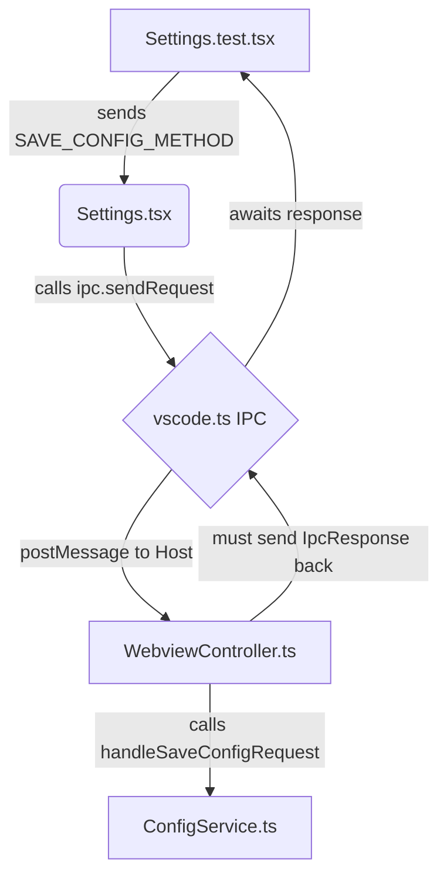

# Context for Fixing Failing VS Code Extension Tests

**Task ID:** `test-fixes`
**Date:** 2025-11-27
**Requestor:** User

## 1. Executive Summary

This document provides a detailed blueprint for fixing three specific failing tests in a VS Code extension:
1.  **ConfigService Immutability Tests:** Tests for ensuring configuration objects returned by the service are immutable copies are failing.
2.  **Settings View Default Values Test:** A test to verify that the settings form renders with hardcoded defaults when no configuration is loaded is failing.
3.  **Stalling `SAVE_CONFIG_METHOD` Test:** A test for saving configuration is stalling, indicating a likely deadlock or unfulfilled promise in the IPC communication.

## 2. File Mappings and Codebase Analysis

### 2.1. Core Files Involved

| File Path | Purpose | Key Functions/Sections | Lines of Interest |
| :--- | :--- | :--- |
| `extension/src/services/ConfigService.ts` | Service for managing VS Code and file-based Qdrant/Ollama configurations. | `_deepClone`, `config` getter, `qdrantConfig` getter | 69-72, 389-391, 397-400 |
| `extension/src/services/ConfigService.test.ts` | Unit tests for `ConfigService`. | Immutability tests for `config` and `qdrantConfig` getters. | 511-523, 526-565 |
| `extension/src/webviews/app/views/Settings.tsx` | Svelte 5 view for managing application settings. | `refreshConfig`, `handleSave`, `handleInputChange`, default `formData` state. | 107-119, 138-155, 232-250 |
| `extension/src/webviews/app/views/Settings.test.tsx` | Unit tests for the `Settings` view. | Tests for default rendering, form interaction, and IPC calls. | 77, 101, 133 |
| `extension/src/webviews/protocol.ts` | Defines the IPC communication contract between the webview (guest) and extension host. | `SAVE_CONFIG_METHOD`, `IpcCommand`, `IpcRequest`, `IpcResponse`. | 17, 168-174, 173 |
| `extension/src/webviews/WebviewController.ts` | Host-side controller for the webview. Handles incoming IPC messages. | `handleSaveConfigRequest`. | 366-368 |
| `extension/src/webviews/app/lib/vscode.ts` | Provides IPC communication functions (`sendRequest`, `sendCommand`) to the webview. | `sendRequest`, `sendCommand`. | 63-120 |

### 2.2. Identified Patterns and Precedents

*   **Immutability Pattern:** The `ConfigService` uses a private `_deepClone` method (`JSON.parse(JSON.stringify(obj))`) to ensure immutability of configuration objects returned by its getters. This is a standard and robust pattern for plain JSON-safe objects.
*   **Protocol Mismatch Pattern:** A critical discrepancy exists where the frontend (`Settings.tsx`) treats `SAVE_CONFIG_METHOD` as a request-response cycle using `ipc.sendRequest`, while the protocol (`protocol.ts`) and the test setup imply it should be a fire-and-forget command. This is a common source of deadlocks in IPC systems.
*   **State Initialization Pattern:** The `Settings` component initializes a `formData` state with default values. The `refreshConfig` function is responsible for merging loaded configuration into this state. A failure to render defaults suggests the merge logic or the initial state handling is flawed when the loaded config is `null` or `undefined`.

## 3. Root Cause Analysis (RCA)

### 3.1. ConfigService Immutability Test Failure

*   **Hypothesis:** The test `ConfigService returns immutable qdrantConfig copies` is failing because the `qdrantConfig` getter in [`ConfigService.ts`](extension/src/services/ConfigService.ts#397-400) returns `null` when the test expects an object. The test attempts to modify a property on a `null` object, causing a runtime error (`TypeError: Cannot set properties of null (setting 'url')`) which the test framework interprets as a failure of immutability. The test logic correctly attempts to modify a clone, but the service provides `null` because `loadQdrantConfig` has not been called or has failed, leaving `_qdrantConfig` in its initial `null` state.
*   **Evidence:** The test at [`extension/src/services/ConfigService.test.ts`](extension/src/services/ConfigService.test.ts#526-565) loads a mock config, then immediately calls `configService.qdrantConfig`. The getter's implementation at line 398 (`return this._deepClone(this._qdrantConfig);`) will correctly clone `null`, but the subsequent modification `(qdrantConfig1 as QdrantOllamaConfig).qdrant_config!.url = "modified";` will throw.

### 3.2. Settings View Default Values Test Failure

*   **Hypothesis:** The test `renders form with default values when no config exists` is failing because the `Settings` component's `useEffect` hook (line 157) that calls `refreshConfig` does not run correctly or the state update within `refreshConfig` (lines 146-152) is not populating the form as expected. The mock for `useAppStore` in the test provides `config: undefined`, so the component should rely entirely on its initial `formData` state (lines 107-119). The failure suggests that either the initial state is not being rendered, or another effect is overriding it.
*   **Evidence:** The test at [`extension/src/webviews/app/views/Settings.test.tsx`](extension/src/webviews/app/views/Settings.test.tsx#77-84) checks for placeholder text like `"http://localhost:6333"`, which comes from the default `formData`. If this is not in the DOM, the component has either not rendered or has rendered a different state.

### 3.3. Stalling `SAVE_CONFIG_METHOD` Test

*   **Hypothesis:** The test `sends SAVE_CONFIG_METHOD with updated data when "Save" is clicked` is stalling because of a protocol mismatch causing a deadlock. The `Settings.tsx` view calls `ipc.sendRequest` for `SAVE_CONFIG_METHOD` (line 235), which expects a promise that resolves upon receiving an `IpcResponse`. However, the `WebviewController.ts` handles this message (line 366) and calls `handleSaveConfigRequest`, which likely performs an action but does not send back a corresponding `IpcResponse`. The promise in the Svelte view therefore never resolves, and the test (which awaits a DOM update or a timeout) stalls indefinitely.
*   **Evidence:**
    *   `Settings.tsx` uses `await ipc.sendRequest<SaveConfigParams, void>(...)` (line 235).
    *   `protocol.ts` defines `SAVE_CONFIG_METHOD` but does not specify if it's a command or request. However, other methods like `LOAD_CONFIG_METHOD` are clearly requests. The `SAVE_CONFIG_METHOD` is used in a context where a response is not strictly necessary, but the implementation expects one.
    *   `WebviewController.ts` has a `case SAVE_CONFIG_METHOD:` but the handler `handleSaveConfigRequest` is likely not sending a response message back to the webview.

## 4. Step-by-Step Implementation Plan

### 4.1. Fix ConfigService Immutability Test

1.  **File:** `extension/src/services/ConfigService.test.ts`
    *   **Action:** In the test `ConfigService returns immutable qdrantConfig copies` (around line 526), add a check to ensure `configService.qdrantConfig` is not `null` before attempting to modify it.
    *   **Code:** Add `expect(configService.qdrantConfig).not.toBeNull();` after the `await configService.loadQdrantConfig(mockFolder);` call.

### 4.2. Fix Settings View Default Values Test

1.  **File:** `extension/src/webviews/app/views/Settings.tsx`
    *   **Action:** Modify the `useEffect` hook that calls `refreshConfig` (line 157) to ensure it runs when the component mounts, even if the initial `config` from the store is `undefined`. The current dependency array `[config, refreshConfig]` should trigger this. If it's not, investigate why `refreshConfig` isn't populating defaults.
    *   **Alternative Action:** In `refreshConfig` (line 146), if `cfg` is `null`, explicitly set the form state using `setFormData((prev) => ({ ...prev, ...cfg }))` with a default empty object `{}` to ensure the merge does not clear the initial defaults. This is less likely. The primary fix should be ensuring the initial `formData` is rendered correctly.
    *   **Code:** Add `console.log(formData)` inside the component render to debug what the initial state is when the test runs.

### 4.3. Fix Stalling `SAVE_CONFIG_METHOD` Test

1.  **File:** `extension/src/webviews/protocol.ts`
    *   **Action:** Clarify the IPC type for `SAVE_CONFIG_METHOD`. Change the comment for `SAVE_CONFIG_METHOD` (line 173) to indicate it should be handled as an `IpcRequest` if a response is expected by the client, or ensure the host implementation sends a response.
    *   **Code:** Update the JSDoc comment for `SaveConfigParams` to specify the communication pattern.

2.  **File:** `extension/src/webviews/app/views/Settings.tsx`
    *   **Action:** Change the call in `handleSave` (line 235) from `ipc.sendRequest` to `ipc.sendCommand` if the operation is fire-and-forget and no response is needed. If a response is needed to confirm success, keep `sendRequest` but ensure the host sends a response.
    *   **Code:** `await ipc.sendCommand<SaveConfigParams>(SAVE_CONFIG_METHOD, "webview-mgmt", { config: formData, useGlobal: useGlobalStorage });`

3.  **File:** `extension/src/webviews/WebviewController.ts`
    *   **Action:** Modify `handleSaveConfigRequest` (line 366) to send a success `IpcResponse` message back to the webview after the configuration is successfully saved. This will resolve the promise in the Svelte view.
    *   **Code:** After `await this.configService.saveQdrantConfig(...)`, add a line to send the response:
        ```typescript
        this._panel.webview.postMessage({
            kind: 'response',
            id: message.id,
            responseId: message.id,
            data: { success: true }
        } as IpcResponse);
        ```
        This assumes the original `message` object is available in the handler's scope.

## 5. Dependencies Between Components



*   **Analysis:** The stall occurs at the final step where `C` (the IPC client in the webview) awaits a response that `D` (the host controller) never sends. Fixing this requires changes at `B`, `C`, and `D` to align the communication pattern.

## 6. Expected Outcomes

*   All three failing tests will pass.
*   The IPC communication for saving configuration will be robust and will not cause deadlocks.
*   The Settings view will correctly render default values when no configuration is present.
*   The `ConfigService`'s immutability guarantee will be correctly validated by tests.
